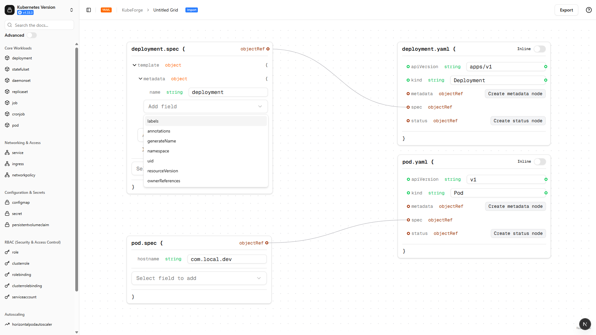
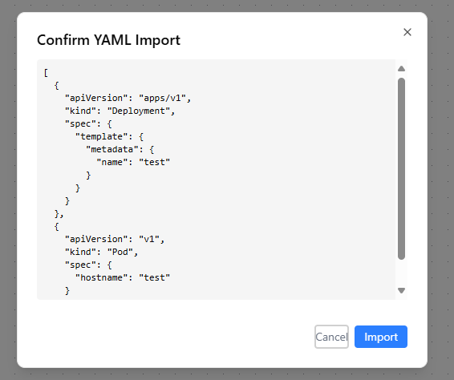
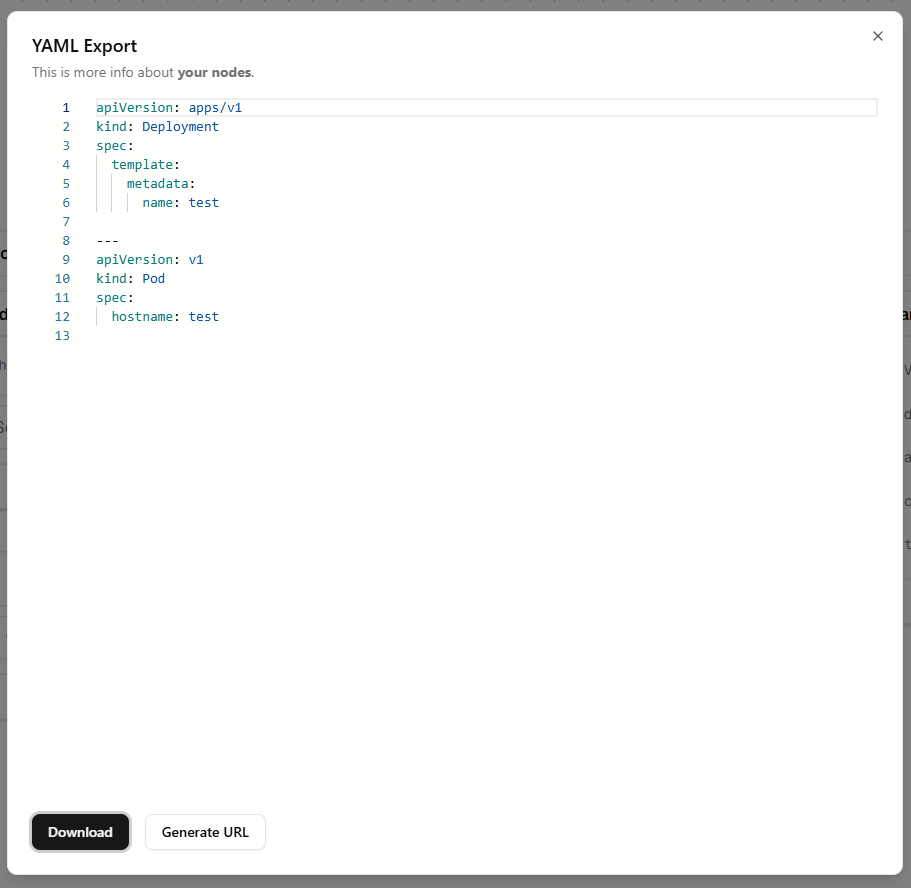
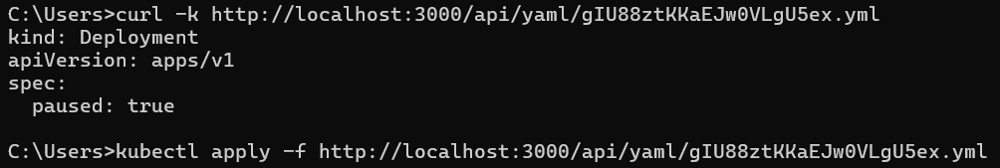

<h1>
  
  <a href="https://kubefor.ge">KubeForge</a>
</h1>

To get started just run:
```
docker run -p 3000:3000 get.kubefor.ge/latest
```

**KubeForge** is a visual-first toolkit that simplifies the process of building, validating, and managing Kubernetes deployment configurations. Whether you're new to Kubernetes or maintaining large-scale systems, KubeForge streamlines the creation of valid deployment YAMLs using an intuitive interface backed by live schema references.



## ✨ Features

- 📦 Drag-and-drop interface for Kubernetes objects
- 📘 Smart schema awareness powered by Kubernetes JSON schemas
- 🧩 Modular component editor with support for templates and reusable specs
- 🔁 Real-time visual updates and dependency linking between resources
- ⚙️ Export ready-to-apply YAML files

## 🚀 Goals

- Reduce the learning curve for Kubernetes configuration
- Eliminate syntax and schema errors during development
- Help DevOps teams and developers prototype deployment setups visually
- Support real-time collaboration and configuration sharing in the future

## ⚙️ How It Works

KubeForge keeps Kubernetes definitions up to date by integrating with [kubenote/kubernetes-schema](https://github.com/kubenote/kubernetes-schema), a companion repository that runs a scheduled job daily. This job fetches the latest official Kubernetes JSON schemas for all supported versions.

These schemas are then automatically pulled into the KubeForge app, ensuring the editor always uses the most current, version-specific spec definitions. This guarantees that users are building against accurate Kubernetes configurations, with proper field validation and metadata.

Additionally, KubeForge enables **direct YAML hosting**, so you can reference built configurations from a stable URL when deploying nodes via automation or GitOps pipelines.


## 📂 Screenshot

The UI provides a live visual representation of object relationships and fields:

> 
> 
> 
> 
> 
> 

## 🛠️ Coming Soon

- Real-time validation against cluster versions
- Helm chart generation
- GitOps-style export templates

---

Feel free to contribute, file issues, or request features!
